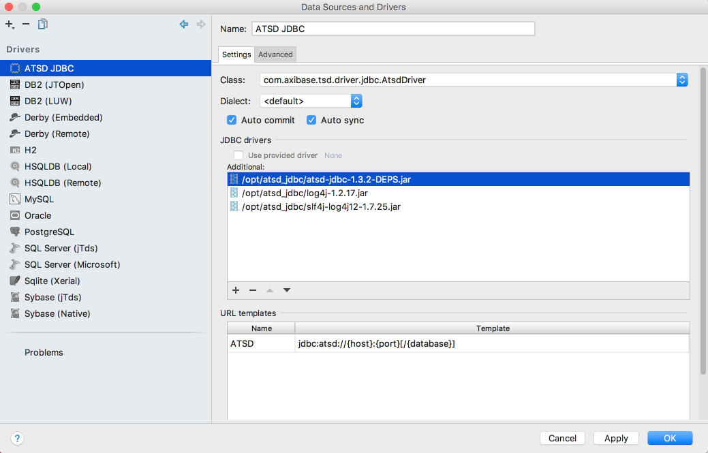
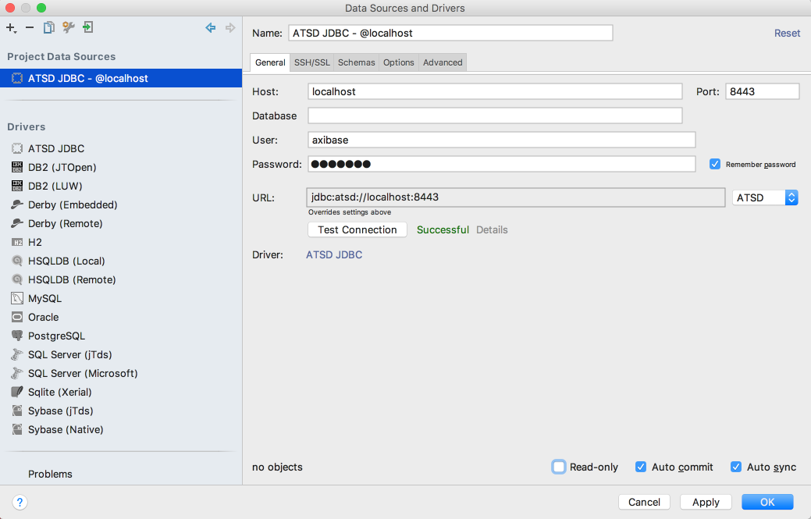
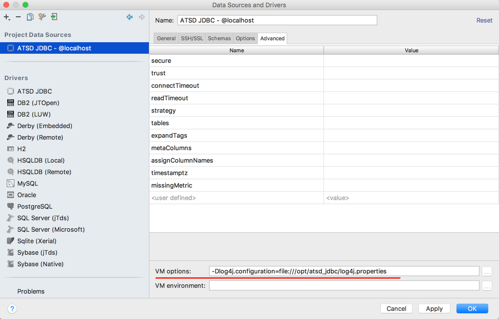
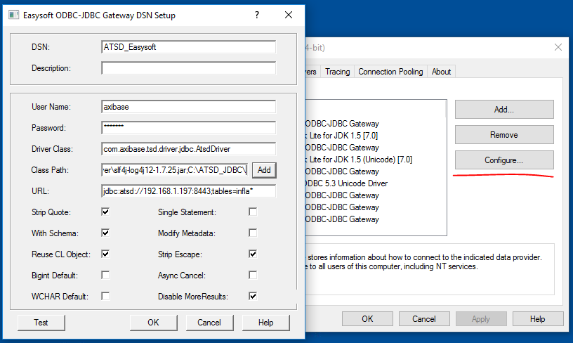

# Tracing and Logging

The ATSD JDBC driver uses the [SLF4J](https://www.slf4j.org/) facade for its internal logging which provides support for pluggable logging implementations. The default configuration redirects all logging messages to the NO-OP (non-logging) appender.

## Downloads

You may use any logging library supported by SLF4J. The examples below are based on log4j. 

Download the [log4j library](http://central.maven.org/maven2/log4j/log4j/1.2.17/log4j-1.2.17.jar) and [slf4j-log4j binding](http://central.maven.org/maven2/org/slf4j/slf4j-log4j12/1.7.25/slf4j-log4j12-1.7.25.jar).

### Enabling logging for applications with enabled SLF4J logging

To turn on logging for particular ATSD JDBC methods, configure/add appenders for ATSD JDBC driver classes in the current logging configuration.

Take the [SQuirrel SQL](http://www.squirrelsql.org/) client as an example. 

* Open the file $SQUIRREL_HOME/log4j.properties file.

* Add the following settings to write ATSD JDBC driver tracing messages to the `atsd_jdbc.log` file in the `/tmp` directory:

```
log4j.appender.file=org.apache.log4j.RollingFileAppender
log4j.appender.file.File=/tmp/atsd_jdbc.log
log4j.appender.file.MaxFileSize=10MB
log4j.appender.file.MaxBackupIndex=10
log4j.appender.file.layout=org.apache.log4j.PatternLayout
log4j.appender.file.layout.ConversionPattern=%d{yyyy-MM-dd HH:mm:ss} %-5p %c{1}:%L - %m%n

log4j.logger.com.axibase.tsd.driver.jdbc=TRACE, file
```

### Enabling logging for applications without enabled SLF4J logging

Some tools either do not use SLF4J or execute the driver's code in an isolated process. To enable logging in this case, you need to provide a logging framework library jar and [slf4j bindings](https://www.slf4j.org/manual.html#swapping).

Lets enable logging for the [DataGrip](https://www.jetbrains.com/datagrip/) tool as an example.

* Make sure that the ATSD JDBC driver, necessary logging dependencies, and logging configuration files are located in the /opt/atsd_jdbc directory.

* Create a ATSD JDBC driver configuration in DataGrip.



* Create a driver connection.



* Provide a path to the logging configuration in the VM Option text bar.




### Enabling logging for ODBC-JDBC bridge

For this example we will be using the Easysoft [ODBC-JDBC bridge](https://github.com/axibase/atsd/blob/master/integration/odbc/README.md).

* Copy the ATSD JDBC driver and logging dependencies in the `C:\JDBC_Driver` directory.
* Create a `log4j.properties` file in the `C:\JDBC_Driver` directory as follows:

```
# Root logger option
log4j.rootLogger=TRACE, file

# Direct log messages to a log file
log4j.appender.file=org.apache.log4j.RollingFileAppender

log4j.appender.file.File=C:\\JDBC.log
log4j.appender.file.MaxFileSize=10MB
log4j.appender.file.MaxBackupIndex=10
log4j.appender.file.layout=org.apache.log4j.PatternLayout
log4j.appender.file.layout.ConversionPattern=%d{yyyy-MM-dd HH:mm:ss} %t %-5p %c{1}:%L - %m%n
```

This will redirect driver trace messages to the file `C:\JDBC.log`.

* Open the ODBC Data Sources and choose the configured ATSD Gateway. 

* Change the classpath by adding logging dependencies and directory.



If the log file gets populated when you test ODBC connection using the ODBC Data Sources tool but does not work in the application using this connection, check that the user has permissions to write into this file.
